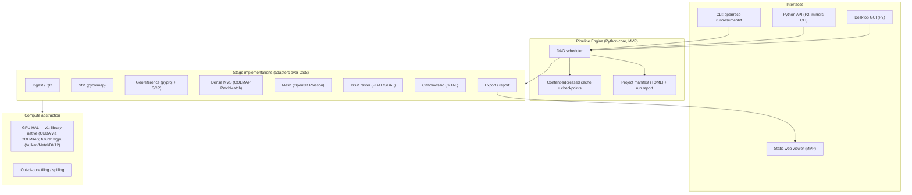

# 03 — Architecture

## Guiding principles

1. **Slice over breadth.** One thin end-to-end path runs before any feature is widened.
2. **DAG is the product.** The pipeline is a typed graph of stages with content-addressed caching,
   checkpointing, and deterministic re-runs. The "project" is the DAG spec + cache, not a binary blob.
3. **Wrap, don't rewrite (yet).** v1 orchestrates mature permissive OSS. Reimplement a stage in
   Rust only when it differentiates or a license blocks us.
4. **Stable seams.** Every stage is an interface; the implementation behind it is swappable
   (classic vs neural MVS, SIFT vs learned matching) without touching the engine.
5. **Out-of-core by default.** Tiled data model; never assume a dataset fits in RAM/VRAM.

## System overview



## Tech-stack decisions + tradeoffs

### Core language

| Option | Pros | Cons | Decision |
|---|---|---|---|
| **Python orchestration over native OSS** | Fastest path to working slice; pycolmap/GDAL/Open3D/gsplat all have Python bindings; easy to script | GIL; not the place for custom hot loops | **Chosen for v1 engine + adapters** |
| Rust core now | Memory-safe, fast, single-binary, wgpu GPU HAL for free | Months of plumbing before a slice exists; binding OSS is slower | **Deferred** — target for hot stages (Phase 3+) |
| C++ core now | Matches most OSS natively (COLMAP/PDAL/GDAL are C++) | Memory-unsafe, slow solo iteration, manual GPU multi-backend | Rejected for solo build |

**Rationale:** solo + slice-first ⇒ Python now. Module boundaries are drawn so any stage can be
re-implemented as a Rust extension (PyO3) later without engine changes.

### GPU strategy (answers "GPU-agnostic + native Apple Silicon")

| Phase | Approach | Covers |
|---|---|---|
| v1 (slice) | Use COLMAP's CUDA path where present; CPU fallback everywhere | NVIDIA + CPU. Honest: no Metal accel yet |
| Phase 3 | Custom hot kernels in **Rust + wgpu** | One codebase → Vulkan / **Metal** / DX12 / GL → NVIDIA + **Apple Silicon** + AMD |

**Why wgpu over hand-maintaining CUDA+Metal+ROCm:** a solo dev cannot maintain three GPU backends.
wgpu gives the hardware-abstraction layer the brief demands from a single Rust/WGSL codebase, and is
the tractable route to first-class Apple-Silicon acceleration.

### Project format & reproducibility

- **Manifest:** `project.toml` — inputs (image dir + hashes), CRS, GCP file, per-stage parameters,
  pinned tool versions.
- **Cache:** content-addressed (`cache/<sha256>/`). A stage's output key = hash(stage id + params +
  input keys + tool versions). Unchanged inputs ⇒ cache hit ⇒ skip. This *is* checkpoint/resume.
- **Determinism:** fixed seeds where libraries allow; record nondeterministic stages explicitly in the report.
- **Diff:** `openreco diff a.toml b.toml` compares manifests + per-stage keys to explain what changed.

### Out-of-core / tiling

- Images streamed, never all decoded at once.
- Dense cloud and rasters processed in tiles; DSM/ortho built tile-by-tile via GDAL VRT.
- Large point clouds via PDAL pipelines + LAZ; spill to disk between stages (cache is on disk anyway).

### Web viewer

- Static bundle: **three.js** (MIT) renders mesh + point cloud; distance measurement tool.
- Phase 2: gaussian-splat renderer; **CesiumJS** (Apache) + 3D Tiles for geo-streaming of big models.
- "Shareable" in v1 = a self-contained output folder you can zip or host statically (no server needed).

## Module boundaries (the stable seams)

```
openreco/
  engine/        # DAG, scheduler, cache, manifest, reporting — knows nothing about photogrammetry
  stages/        # one module per stage; each implements the Stage protocol
    ingest.py  sfm.py  georef.py  mvs.py  mesh.py  dsm.py  ortho.py  export.py
  io/            # readers/writers: images+EXIF, LAS/LAZ, GeoTIFF, PLY/OBJ/glTF
  geo/           # CRS, GCP, transforms (pyproj)
  compute/       # device detection, tiling helpers, future wgpu bridge
  cli.py         # openreco run/resume/diff/report
  viewer/        # static three.js web bundle template
docs/            # these documents
tests/
samples/         # tiny synthetic dataset for CI
```

### Stage protocol (the one interface that matters)

```python
class Stage(Protocol):
    id: str
    def params_schema(self) -> dict: ...          # JSON-schema of tunables (drives presets/GUI later)
    def cache_key(self, ctx: RunContext) -> str: ...
    def run(self, ctx: RunContext) -> StageResult: ...   # idempotent; writes to ctx.cache_dir
    def validate(self, result: StageResult) -> list[Issue]: ...  # feeds QA report + "doctor"
```

`RunContext` carries: resolved params, input artifact handles, cache dir, device info, logger,
progress/cancel callbacks. Stages never call each other — only the engine wires them via the DAG.

## License posture (enforced)

| Component | License | Role | Permissive? |
|---|---|---|---|
| COLMAP / pycolmap | BSD | SfM + **dense PatchMatch MVS** | ✅ |
| GLOMAP | BSD | Global SfM (P2) | ✅ |
| GDAL / rasterio | MIT/X11-style | DSM, orthomosaic, GeoTIFF | ✅ |
| PROJ / pyproj | MIT | CRS/datum transforms | ✅ |
| PDAL | BSD | Point-cloud tiling/classification | ✅ |
| ~~Open3D~~ | MIT | ~~Meshing~~ | ⚠️ **dropped** — no Python 3.13 wheel; replaced by pycolmap meshing + scipy |
| scipy | BSD | normals, 2.5D Delaunay, DSM interpolation | ✅ |
| laspy + laszip | BSD/LGPL-ish | LAS/LAZ I/O | ✅ |
| LightGlue / ALIKED / DISK | Apache-2.0 | Learned matching (P2) | ✅ |
| gsplat (Nerfstudio) | Apache-2.0 | 3DGS branch (DIFF) | ✅ |
| three.js / CesiumJS | MIT / Apache | Web viewer | ✅ |
| **OpenMVS** | **AGPL** | dense MVS | ❌ **EXCLUDED** — replaced by COLMAP PatchMatch |
| **SuperGlue/SuperPoint** | **non-commercial** | matching | ❌ **EXCLUDED** — use LightGlue/ALIKED |

A CI check parses dependency licenses and fails the build on any non-permissive (copyleft/NC) entry.
