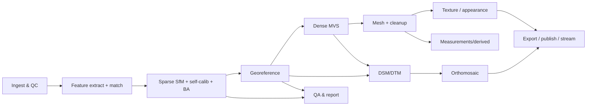

# 04 — Reconstruction Pipeline Spec

Each stage lists **default** (v1), **fallback/alternative**, inputs/outputs, key params, and failure
modes. All stages are idempotent and content-addressed (see 03).

## 1. Ingest & validate
- **In:** image folder. **Out:** image table (path, EXIF, GPS, intrinsics guess), QC flags, optional masks.
- **Default:** read EXIF/GPS (Pillow/exiftool); blur score (variance of Laplacian); exposure check;
  auto-cull below threshold (kept, just flagged "excluded" — non-destructive).
- **Fallback:** if no EXIF GPS, mark project as "needs GCP or arbitrary scale."
- **Failures:** mixed cameras (group by intrinsics), corrupt images (skip + report).

## 2. Feature extraction & matching
- **Default:** COLMAP SIFT + vocab-tree / sequential / exhaustive matching (choose by image count).
- **Alternative [P2]:** learned **ALIKED/DISK + LightGlue** (Apache) for low-texture/wide-baseline.
- **Out:** features + match graph. **Failures:** too few matches → flag disconnected components to "doctor".

## 3. Sparse SfM + self-calibration + bundle adjustment
- **Default:** COLMAP **incremental** mapper; self-calibrating intrinsics; robust BA (Ceres).
- **✅ Alternative (implemented):** **GLOMAP** global SfM (`mapper="global"`) — rotation averaging +
  global positioning, for large unordered sets (BSD). Validated on Sceaux (11/11 registered).
- **Out:** camera poses, refined intrinsics, sparse point cloud, per-image reproj error.
- **Failures:** drift on long corridors → suggest sequential matching / more overlap; multiple
  disconnected models → report + let user pick/merge.

## 4. Georeferencing
- **Default (v1):** similarity transform from EXIF-GPS camera centers → target CRS (pyproj).
- **✅ GCP file (implemented):** `name,X,Y,Z,image,u,v` CSV → DLT-triangulate each GCP in the
  reconstruction, Umeyama similarity fit to world coords, report per-GCP residuals. Validated on
  real aerial data (RMS 0.04 m on synthetic-exact GCPs vs 2.74 m for consumer GPS).
- **[P2]:** coded/non-coded target **auto-detect** + sub-pixel refine; scale bars; geoid/datum incl.
  NTv2 grids; full georeferenced BA (GPS/GCP as observations inside the adjustment, not post-hoc fit).
- **Out:** world-CRS poses + transform; GCP residual table. **Failures:** <3 GCPs / poor GPS → fall
  back to arbitrary scale + warn that products are non-metric.

## 5. Dense reconstruction (MVS)
- **✅ Default (implemented):** COLMAP **PatchMatch stereo** depth/normal maps → **stereo fusion** →
  dense cloud (BSD, *avoids AGPL OpenMVS*). PatchMatch is CUDA-only; since the PyPI pycolmap is
  CPU-only, dense is driven by a CUDA-enabled COLMAP **binary** (`openreco/compute.py`). MVS
  normals carry into Poisson meshing. **CPU fallback:** the sparse SfM cloud (flagged).
- **Quality knob:** image downscale factor + window radius + geometric-consistency on/off.
- **Neural branch [DIFF]:** **3DGS via gsplat** from the *same* COLMAP poses → real-time/photoreal &
  view-dependent surfaces; kept registered to the metric solution.
- **Out:** dense point cloud (LAS/LAZ), depth maps. **Failures:** reflective/transparent → fewer points
  in those regions; route to difficult-surface mode (P3) or neural branch.

## 6. Surface reconstruction (mesh)
- **Default:** **Open3D screened Poisson** from dense cloud + normals; trim by density; optional decimation.
- **Fallback:** Delaunay/ball-pivoting for sparse regions; COLMAP Poisson/Delaunay meshing.
- **[P2]:** hole filling, smoothing, manifold cleanup, watertight option for VFX path.
- **Out:** `mesh.ply/obj`. **Failures:** noisy normals → recompute normals / increase trim density.

## 7. Texturing / appearance
- **v1:** simple per-face best-view texture or vertex color (enough to validate the slice).
- **[P2]:** UV unwrap + texture atlas + multi-image blending + de-lighting/color balance → PBR maps.
- **[DIFF]:** bake 3DGS appearance onto the metric mesh (splat appearance + mesh geometry fusion).

## 8. Derived products
- **DSM [v1]:** rasterize dense cloud to a gridded surface (PDAL/GDAL), GeoTIFF.
- **✅ Contours:** marching-squares iso-lines from the DSM → WGS84 GeoJSON (one MultiLineString
  per elevation). **Coverage map:** per-image ground footprints → overlap-count GeoTIFF + PNG.
- **Orthomosaic [v1]:** orthorectify source images using mesh/DSM + poses, mosaic + blend → GeoTIFF.
- **[P2]:** DTM (ground classification then interpolate), seamline editing + inpainting, volumes,
  cross-sections, point-cloud classification, NDVI/multispectral.

## 9. QA & reporting
- **v1:** `report.html` — reprojection error stats, GCP residuals, image coverage map, camera count,
  point counts, parameters used + tool versions (reproducibility block).
- **[DIFF]:** confidence/uncertainty visualization; "alignment doctor" narrative explaining failures.

## 10. Export / publish / stream
- **v1:** PLY/OBJ (mesh), LAS/LAZ (cloud), GeoTIFF (DSM/ortho), glTF; static three.js viewer folder.
- **[P2]:** FBX, USD/USDZ, COPC, 3D Tiles, DXF, KML/KMZ, 3D PDF; splat `.ply/.splat/.spz`.

## Recipes (presets over the same DAG)

- **UAV-Mapping (v1 hero):** sequential/vocab match → incremental SfM → GPS+GCP georef → PatchMatch
  MVS (medium) → Poisson mesh → DSM → ortho.
- **Object/Heritage [P2]:** exhaustive match → SfM → scale bars → high-quality MVS → watertight mesh →
  UV+PBR texture.
- **Photoreal/VFX [DIFF]:** SfM → 3DGS branch → optional mesh fusion → splat export.
